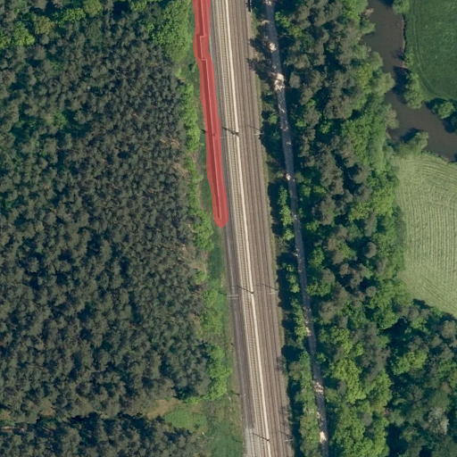
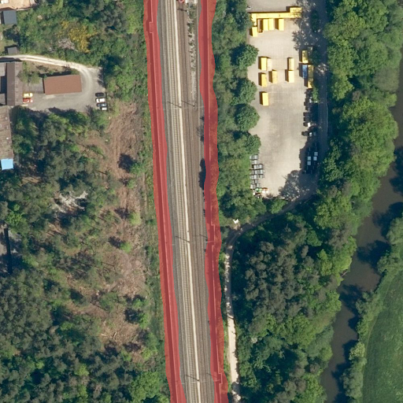
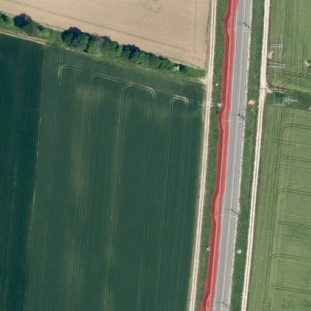

# Noise Insulating Wall Detection from Aerial Imagery

## Introduction

This project is a collaboration between Merantix Momentum and the Deutsches Zentrum für Schienenverkehrsforschung beim Eisenbahn-Bundesamt to enable a fully automated noise mapping process across the whole Germany. The goal of the project is to segment noise insulating wall from aerial imagery near railways. This repository contains the exported ONNX model file and documentation for our machine learning solution tailored for the detection of noise insulating walls from aerial imagery near railways. 

## Project Overview

Our project focuses on developing a machine learning solution to detect noise insulating walls from aerial imagery. We employ state-of-the-art techniques in deep learning to accurately identify these walls, which are crucial for various urban planning and environmental management applications.

## Key Features

- **Model Export**: Our solution provides the exported ONNX model file, ready to be used for inference.
- **Integration with QGIS**: Our solution seamlessly integrates with QGIS, enabling users to apply the trained model to their image data within the QGIS environment.

## Getting Started

To get started with using our model in QGIS, follow these steps:

1. **Download the Model**: Download the exported ONNX model file (`model.onnx`) from the [releases page](https://github.com/yourusername/project/releases).
2. **Install QGIS**: If you haven't already, install QGIS on your machine. You can download it from the [official QGIS website](https://qgis.org/en/site/forusers/download.html).
3. **Load the Model in QGIS**: Open QGIS and load the `model.onnx` file into the Deepness plugin.
4. **Configure Parameters**: Set the required parameters, including image resolution and processing options.
5. **Run Inference**: Click "Run" to start the inference process and obtain segmentation results.

## License

Our project is licensed under the [MIT License](LICENSE).

## Contact Us

If you have any questions, suggestions, or feedback, feel free to reach out to us at [email@example.com](mailto:email@example.com).

## Prediction Examples
  
